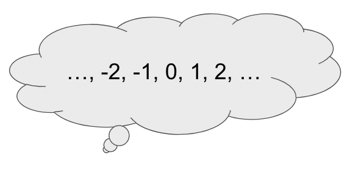

# 6-0-0-nodes-and-linked-lists

Welcome to the introductory lecture of Mod X! Today, we're diving into the fundamentals of nodes and linked lists in JavaScript.

Nodes? They're the building blocks of linked lists, acting as data containers in a connected chain.

In this session, we'll unravel the mechanics of linked lists and explore why they're a valuable tool in data management.

So, let's embark on this journey into the world of nodes and linked lists, paving the way for deeper explorations ahead!

## Data Structures and Abstract Data Types

In Computer Science, a data structure is a way of organizing and storing data in a computer so that it can be accessed, modified and processed efficiently.

You can think of as:

* Inputting information
* Processing information
* Maintaining information
* Retrieving information

Up to this point one of the main data structure we have been working with are arrays.


But what if we have a data structure that we know how it inputs, processes, maintains, and gets data, but we don't know how we are going to implement?

### ADT

An **abstract data type (ADT)** is a general description about a data type: how it stores data and what operations can be performed on/with it. Abstract data types may be implemented differently in different programming languages but they will all have the same high-level behavior.



For example, an integer is an abstract data type.

* **How they store data**: integers represent a single numerical value in the range `...`, `-2`, `-1`, `0`, `1`, `2`, `...`.
* **Operations that can be performed**: integers can be added together, subtracted, multiplied, and divided. 
* **Implementations may vary**: In Java, integers are their own data type, separate from floats (numbers that have decimal points). In JavaScript, integers and floats are all considered the same data type.


In the real world, the idea of a car is similar to an abstract data type. All cars have doors, wheels, and an engine and with my driver's license, I can operate pretty much any kind of car. However, each manufacturer has a different approach to creating their cars and, under the hood (literally), they may look very different.

<details><summary>Q: What are some other real world analogies of abstract data types?</summary>

* shoes
* notebooks
* tables
* etc...

The list is limitless.

</details>
<br>

Examples of common abstract data types in JavaScript include:

* Linked List
* Stack
* Queue
* Hash Table (map)
* Tree
* Set
* Graph

## So What is a Linked List?

A Linked List is a data structure that consists of a sequence of objects, called nodes, each contains a link (or pointer) to the next node in the list. The first node in the list is called the head, and the last node in the list is called the tail.

[Visual examples](https://visualgo.net/en/list)

## Simple Linked list:


```js
const node1 = {//node
  data: 'A', //data
  next: node2
};

const node2 = {
  data: 'B'
};

const node3 = {
  data: 'C'
};

const node4 = {
  data: 'D'
};

console.log(node1);

node1.next = node2;//pointer(link or reference)
node2.next = node3;
node3.next = null
```

In JavaScript, a Linked list can be implemented using Object Oriented Programming(OOP), where each object represents a node, and contains a property that refers to the next node in the list.

## Linked - With Classes

```js
class Node {
  constructor(data) {
    this.data = data;
    this.next = null;
  }
}

class LinkedList {
  constructor() {
      this.head = null;
      // Linked Lists may also have a tail pointer
  }
  appendToHead(data) {
      const newNode = new Node(data);
      newNode.next = this.head;
      this.head = newNode;
  }
  appendToTail(data) { // adding to the end is linear (unless you have a tail pointer)
      debugger;
      const newNode = new Node(data);
      
      if (this.head === null) {
          this.head = newNode;
      } else {
          let curr = this.head;
          while (curr.next !== null) {
              curr = curr.next
          }
          
          curr.next = newNode;
      }
  }
  removeFromHead() { // removing from the head is constant
      if (this.head == null) {
          return;
      }
      this.head = this.head.next // constant
  }
  removeFromTail() { // removing from the tail is ALWAYS linear
      if (this.head === null) {
          return;
      }
      
      let curr = this.head;
      let prev = null;
      if (curr.next) {
          prev = curr;
          curr = curr.next;
      }
      prev.next = null;
  }
}
```

## Benefits and Drawbacks

### Benefits

**Low memory overhead**: Linked lists do not require extra memory for storing the size of the list, unlike arrays.

**Space efficiency**: In a Linked list, the memory is allocated only when a new element is added, so it can be more space-efficient than an array, which needs to pre-allocate memory for a certain number of elements, whether or not they are used.

**No need to shift elements**: In an array, when you insert or delete an element in the middle of the array, you need to shift all the elements after it to make space or fill the gap. This can take O(n) time, where n is the number of elements in the array. In a Linked list, you only need to update the references of the surrounding nodes, so there's no need to shift any elements, making the insertion and deletion more efficient.

### Drawbacks

**Search operations are slower in Linked lists**: In an array, you grab elements using random access, the ability to reference values based on their index. With Linked lists, there is no random access. You must traverse the Linked list starting from the head node.

**Each node requires more memory than an element in an array:** Nodes in a linked list uses more memory than elements in an arrays because og the the pointers that are stored. Rather than being stored in a heap of contiguous memory locations like an array, a Linked list is stored in its own separate node, and each node contains a reference, called a "link", to the next node in the list.

## Linked List Methods

These are the methods that are typically associated with Linked List:

`append(data)`/`prepend(data)`: This method is used to add a new node with a given data to the Linked list. Depending on the implementation, this method can add a new node to the tail/ the head. If you want to add a specific index of the Linked list you would need to write a method for it.

`remove(data)`: This method is used to remove a node with a given data from the Linked list. It typically searches for the first occurrence of the node with the matching data and removes it from the list.

`removeFirst()`/`removeLast()` : This method is used to remove the first or last node in the Linked list.(also known as `removeHead()`/`removeLastTail()`).

`find(data)`: This method is used to find a node with a given data in the Linked list. It typically searches the list for the first occurrence of the node with the matching data and returns it.(you can also call it `contains()`).

`length()`: This method returns the number of nodes in the Linked list.

`isEmpty()`: This method returns a boolean indicating whether the Linked list is empty or not.

`print()`: This method is used to print the data of all the nodes in the Linked list.

These methods are the most common ones, but depending on the implementation, a Linked list can have additional methods such as `getFirst()`, `getLast()`, `get(index)`, `insertAt(data, index)`, `reverse()`, `sort()`, `mergeList()` among others.

The performance of these methods can vary depending on the implementation. For example, an singly Linked list implementation may have a O(n) performance for find and remove methods, while a doubly Linked list implementation would have a O(1) performance for the same methods.

Oh wait! What are singly and doubly Linked list?
